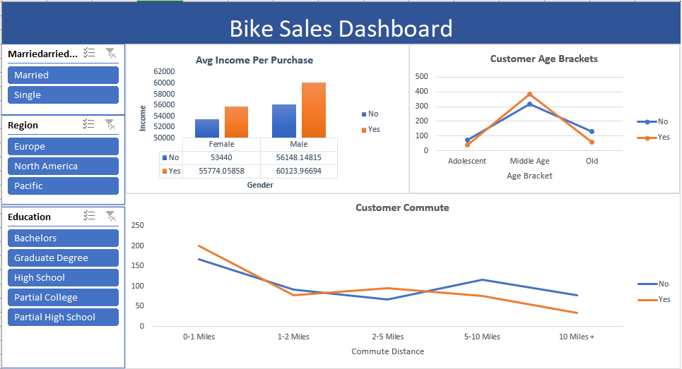

## Bike Sales Dashboard(Interactive Dashboard creation using MS Excel)

📌 Objective:
To analyze customer demographics and behavioral patterns for a bike sales dataset using interactive visualizations and slicers in Excel.

## Dataset used
- <a href="https://github.com/kuketha/Bike-Sale-Dashboard-Analysis/blob/main/bike_row_data.xlsx">Dataset</a>

❓ Key Questions / KPIs:
1. What is the average income per purchase by gender and whether the customer owns a bike?
2. What are the customer age brackets for bike buyers vs non-buyers?
3. How does customer commuting distance relate to bike ownership?
4. What role do marital status, region, and education level play in bike purchasing behavior?

- Dashboard Interaction <a href="https://github.com/kuketha/Bike-Sale-Dashboard-Analysis/blob/main/bike_dashboard.png">View Dashboard</a>

⚙ Process Overview:
1. Data Cleaning:
Raw data from bike_buyers sheet was structured.
Columns for Gender, Income, Age Bracket, Commute Distance, and Bike Buyer were verified

2. Pivot Table Creation:
Created pivot tables on pivot1 sheet to summarize:
Avg. income per gender and bike buyer status.
Age bracket counts grouped by bike buyer.
Commute distance grouped by bike buyer.

3. Dashboard Design:
Used slicers for:
Marital Status
Region
Education Level

Visualized KPIs via:
Bar chart for Avg Income Per Purchase
Line chart for Customer Age Brackets
Line chart for Customer Commute

## Dashboard

💡 Project Insights:

Avg Income Per Purchase:
Males have a higher average purchase income than females.
Customers who own bikes (Yes) show higher average income than non-owners (No).

Age Distribution:
Middle-aged customers form the largest group among both bike buyers and non-buyers.
Adolescents and older customers show lower engagement.

Commute Distance:
Customers commuting 5–10 miles show a higher likelihood of owning bikes.
Very short (0–1 mile) or very long (10+ miles) commutes see less bike ownership.

Filters Impact:
Changing marital status, region, or education level using slicers dynamically updates all visuals, helping stakeholders narrow down buyer segments.

🧾 Final Conclusion:

The dashboard provides valuable insights into the demographics and commuting habits of bike buyers. Target customers are typically middle-aged males with higher incomes, and they tend to commute between 5–10 miles. These findings can help the sales and marketing teams refine their customer targeting strategy, focusing campaigns on high-potential segments.
